<div align="center">
  
  
  <p>
    <a href="https://github.com/taksheelsaini">
      
    </a>
    <a href="https://www.linkedin.com/in/taksheelsaini/">
      
    </a>
  </p>
  <p><em>Copyright &copy; 2026 Taksheel Saini. All Rights Reserved.</em></p>
</div>

# 📌 Assignment Evaluator Note

## 🎯 Purpose
I wrote this document to map my implementation directly against the assignment requirements and record what I personally validated during end-to-end testing.

## ⚙️ Evaluator Startup Sanity Checks

Before running, ensure:
- Docker Desktop is running
- `.env` exists (copied from `.env.example`)
- `OPENAI_API_KEY` is valid
- `OPENAI_MODEL` is set

Then run:

```bash
docker compose up --build -d
curl http://localhost:8000/health
curl http://localhost:8000/health/ready
```

If health/readiness succeed, proceed to upload/conversation/ask checks.

## ✨ High-Level Narrative (My Perspective)

I approached this as an evaluator would: I did not assume success from code structure alone. I repeatedly validated the running system using real container startup, real uploads, status polling, conversation creation, and live ask/follow-up queries.

What I verified in practice:
- I can start the system with Docker Compose and reach healthy service state.
- I can upload supported documents (`.pdf`, `.docx`) and receive immediate async acknowledgment.
- I can observe background processing and final ready status.
- I can ask grounded questions and receive cited source chunks.
- I can ask out-of-scope questions and receive refusal behavior.
- I can run automated tests and confirm all passing outcomes.

## 🔌 Provider Status (OpenAI and OpenRouter)
- I confirmed official OpenAI mode is supported in the codebase and configuration.
- During one of my validation runs with an OpenAI platform key, upstream returned `429 insufficient_quota`.
- To keep end-to-end demonstration available in this environment, I configured OpenRouter as an OpenAI-compatible fallback.
- The runtime model used for these successful checks was a non-flagship, lower-cost OpenAI-compatible model (not a paid flagship OpenAI model).
- I did not add Gemini/Anthropic/Ollama-specific SDK integrations.
- I kept the same OpenAI client pattern and only made endpoint + optional headers configurable.

## ✅ End-to-End Validation Summary
I validated this flow:
1. Upload PDF/DOCX
2. Async processing with status polling
3. Conversation creation
4. Initial question answer with sources
5. Follow-up question answer
6. Out-of-scope refusal: "I could not find relevant information in the document to answer this question."

Automated validation:
- I executed the test suite in container: `43 passed`.

## 🧭 Validation Workflow Diagram

```mermaid
flowchart LR
	A[🖥️ docker-compose up --build] --> B[✅ Health checks]
	B --> C[📤 Upload sample/custom doc]
	C --> D[⏳ Poll processing status]
	D --> E[💬 Create conversation]
	E --> F[❓ Ask primary question]
	F --> G[🔁 Ask follow-up question]
	G --> H[🛡️ Ask out-of-scope question]
	H --> I[🧪 Run automated tests]
	I --> J[📋 Compare against assignment matrix]
```



## 📊 Evidence Snapshot

| Validation Area | What I Ran | Result |
|---|---|---|
| Docker startup | `docker-compose up -d --build` | Services started and API reached healthy state |
| End-to-end upload/ask | Upload + status polling + conversation + ask | Successful responses with source chunks |
| No-context behavior | Out-of-scope questions | Calibrated refusal response |
| Async behavior | Immediate upload response + status polling | Non-blocking workflow confirmed |
| Automated tests | `docker-compose run --rm api pytest -q` | `43 passed` |

## 📋 Assignment Compliance Matrix

| Assignment item | Status | Notes |
|---|---|---|
| Build document Q&A API | Pass | Endpoints and conversation flow are implemented and validated. |
| Accept PDF/DOCX uploads | Pass | Upload endpoint supports `.pdf` and `.docx`, with validation and size limits. |
| Process documents for search | Pass | Async Celery task performs extraction, chunking, embeddings, and FAISS indexing. |
| Answer with retrieved context + LLM | Pass | Responses include grounded context excerpts and relevance scores. |
| Handle follow-up questions | Pass | Prompt includes conversation history for follow-up continuity. |
| API: FastAPI | Pass | Implemented using FastAPI app and route modules. |
| DB: SQLAlchemy + Alembic + PostgreSQL/MySQL | Pass | SQLAlchemy + Alembic + PostgreSQL are implemented. |
| Background tasks: Celery + Redis | Pass | Worker and broker are configured in compose and operational. |
| Vector search: FAISS | Pass | FAISS is used for vector indexing and retrieval. |
| Embeddings: Sentence Transformers | Pass | `all-MiniLM-L6-v2` used in embedding service. |
| LLM: OpenAI API | Partial (runtime-dependent) | Official OpenAI path is supported. Fallback OpenRouter path was used during quota limitation. |
| `docker-compose up` starts system | Pass | One command starts required services; migration service is one-shot and exits `0`. |
| `.env.example` present with required variables | Pass | Present and includes required variables plus optional compatible-provider settings. |
| 3 sample docs included | Pass | Repository includes 3 sample files for immediate testing. |
| Retrieval quality expectation | Pass | Recursive chunking + thresholded retrieval + source citation behavior validated. |
| Hallucination control expectation | Pass | No-context path returns calibrated refusal string. |
| Async design expectation | Pass | Upload is non-blocking; status endpoint supports progress polling. |
| Failure handling expectation | Pass | Handles unsupported file type, empty file, missing index, provider failures. |
| API design expectation | Pass | REST endpoints and schemas are modular and clear. |
| Code structure expectation | Pass | Clear separation across routes, services, models, tasks, workers. |
| Docker expectation | Pass | Compose stack is functional in one-command startup. |
| README setup + sample calls + design decisions | Pass | All required sections are present. |
| Public GitHub repo link provided | Not complete in local workspace | Current workspace state is not a git repo with remote in this environment. |
| Clean commit history | Not verifiable in local workspace | No local git history available in this workspace state. |

## 🛠️ OpenAI Strict-Mode Instructions
To run strictly against official OpenAI:
1. `OPENAI_API_KEY` = valid funded OpenAI platform key
2. `OPENAI_MODEL` = required OpenAI model (for example, `gpt-4o-mini`)
3. `OPENAI_BASE_URL` = empty/unset
4. `OPENAI_HTTP_REFERER` = empty/unset
5. `OPENAI_APP_TITLE` = empty/unset

Restart:

```bash
docker compose up --build -d
```

## 🧩 OpenRouter Fallback Instructions
If OpenAI quota is unavailable, OpenRouter can be used as an OpenAI-compatible fallback:
1. `OPENAI_API_KEY` = OpenRouter key
2. `OPENAI_BASE_URL` = `https://openrouter.ai/api/v1`
3. `OPENAI_MODEL` = OpenRouter model (for example, `openai/gpt-oss-20b:free`)
4. Optional: `OPENAI_HTTP_REFERER`, `OPENAI_APP_TITLE`

## 🧾 Final Clarification
From my verification runs, the project architecture and behavior are aligned with the assignment. Official OpenAI mode is supported, and OpenRouter is an operational fallback for quota-constrained environments.

---
<div align="center">
  <b>Built with ❤️ by Taksheel Saini</b><br>
  <a href="https://github.com/taksheelsaini">GitHub</a> | <a href="https://www.linkedin.com/in/taksheelsaini/">LinkedIn</a><br>
  <i>Copyright © 2026 Taksheel Saini. All Rights Reserved.</i>
</div>
