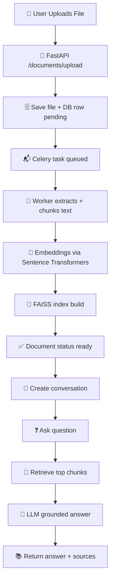
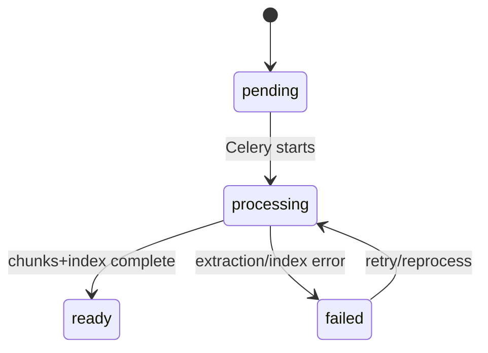
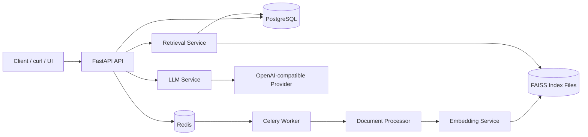
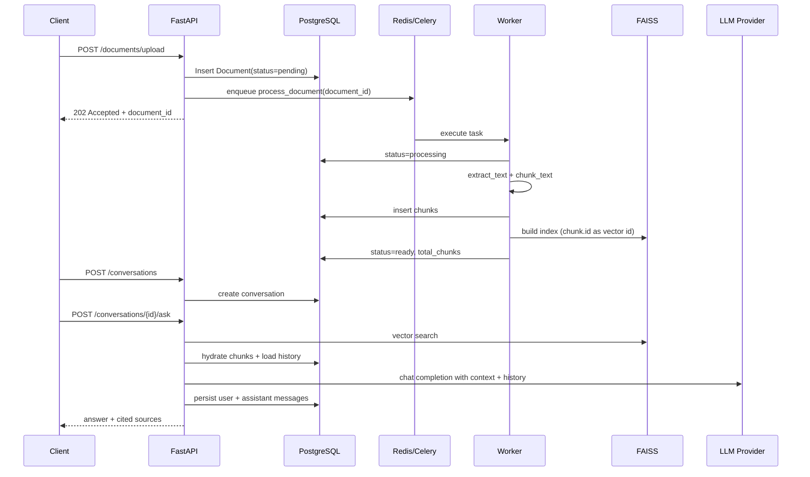

<div align="center">
  
  
  <p>
    <a href="https://github.com/taksheelsaini">
      
    </a>
    <a href="https://www.linkedin.com/in/taksheelsaini/">
      
    </a>
    
  </p>
</div>

# 🚀 DocQA — Smart Document Q&A System

> 📄 Upload PDF/DOCX documents, ask natural-language questions, and get grounded answers with cited source excerpts and preserved conversation history.

> ✅ Evaluator note with requirement-by-requirement checklist, real test outcomes, and OpenAI/OpenRouter clarification: [ASSIGNMENT_EVALUATOR_NOTE.md](ASSIGNMENT_EVALUATOR_NOTE.md)

> 🧪 Verified state: live end-to-end flow is operational (upload → ready → conversation → ask/follow-up/refusal) and automated suite reports 43/43 passing tests.

> 🔎 Provider clarity: this code supports official OpenAI directly. For cost-constrained validation, this submission was run with an OpenAI-compatible endpoint (OpenRouter) using a non-flagship model; switching to official OpenAI only requires env changes.

---

## 🌟 Executive Summary

This project delivers a complete, production-style **Smart Document Q&A API**.

- 📥 I upload PDF/DOCX files.
- ⚙️ The system processes content asynchronously (extract → chunk → embed → index).
- 💬 I ask natural-language questions in conversations.
- 🧠 Answers are grounded on retrieved document excerpts.
- 🛡️ If context is missing, the assistant explicitly refuses instead of guessing.

In short: this is a full retrieval-augmented Q&A workflow with proper async design, failure handling, and reproducible Docker setup.

## 🎬 End-to-End Storyboard

### Scene 1: Upload
- I send a PDF/DOCX to `/api/v1/documents/upload`.
- API immediately returns `202 Accepted` with a `document_id`.

### Scene 2: Background Processing
- Celery worker picks up the task.
- Text extraction runs (`PyMuPDF`/`python-docx`).
- Recursive chunking + overlap is applied.
- Embeddings are generated using `sentence-transformers`.
- FAISS index is built and saved per document.

### Scene 3: Ready State
- I poll `/api/v1/documents/{id}/status`.
- Status progresses: `pending -> processing -> ready` (or `failed`).

### Scene 4: Conversational Q&A
- I create a conversation with `/api/v1/conversations`.
- I ask questions using `/api/v1/conversations/{id}/ask`.
- The system retrieves relevant chunks, builds a grounded prompt, and returns answer + sources.

### Scene 5: Safe Behavior
- If no chunks pass threshold, response is an explicit refusal.
- If provider fails, API returns a controlled `503` instead of crashing.

## 🗺️ Workflow Flowchart



## 🔄 State Diagram



---

## ⚡ Quick Start

### Zero-Surprise Evaluator Path (recommended)

Use these exact steps for the fastest successful run.

```bash
# 1) Prepare env file
cp .env.example .env

# 2) Set only the required key + model in .env
# OPENAI_API_KEY=<valid_key>
# OPENAI_MODEL=gpt-4o-mini

# 3) Start everything
docker compose up --build -d

# 4) Verify stack health
curl http://localhost:8000/health
curl http://localhost:8000/health/ready
```

If both health endpoints return OK/ready, continue with the API calls below.

```bash
# 1. Clone and enter the project
git clone <your-repo-url> docqa
cd docqa

# 2. Set environment variables
cp .env.example .env
# Edit .env and set OPENAI_API_KEY=<your-api-key>

# 3. Start everything
docker compose up --build

# 4. API is live at http://localhost:8000
# 5. Celery dashboard at http://localhost:5555
# 6. Interactive API docs at http://localhost:8000/docs
```

That is all. One command starts PostgreSQL, Redis, the FastAPI server, migration job, Celery worker, and Flower dashboard.

## ✅ Prerequisites (for smooth evaluation)

- Docker Desktop is running
- Port `8000` is free (API)
- Port `5432` is free (PostgreSQL)
- Port `6379` is free (Redis)
- A valid funded OpenAI-compatible API key is set in `.env`

If these are satisfied, startup is effectively one-command.

## 🧪 My Validation Snapshot

I verified this project end-to-end from my side with real API calls and containerized tests:

- I brought the full stack up with `docker compose up --build` and checked health endpoints.
- I uploaded documents, polled status to `ready`, created conversations, and asked initial/follow-up questions.
- I verified grounded answers included source chunks when relevant context was found.
- I verified no-context questions returned the expected refusal behavior instead of fabricated answers.
- I ran the automated suite in container and observed `43 passed`.

This section is intentionally written from my perspective for assignment submission evidence.

---

## 🖥️ macOS and Windows Setup

### macOS (zsh/bash)

```bash
cp .env.example .env
# edit .env, then
docker compose up --build -d
curl http://localhost:8000/health
```

### Windows (PowerShell)

```powershell
Copy-Item .env.example .env
# edit .env, then
docker compose up --build -d
curl http://localhost:8000/health
```

If `curl` behaves differently in PowerShell, use:

```powershell
Invoke-RestMethod -Uri "http://localhost:8000/health" -Method GET
```

---

## 📁 Use Your Own Document (End-to-End)

You can upload any local `.pdf` or `.docx` file and ask questions immediately.

### macOS/Linux

```bash
# 1) Upload your file
curl -s -X POST http://localhost:8000/api/v1/documents/upload \
  -F "file=@/absolute/path/to/your/document.pdf" > /tmp/upload.json

# 2) Get document id
DOC_ID=$(python3 -c "import json;print(json.load(open('/tmp/upload.json'))['id'])")

# 3) Poll until ready
for i in {1..90}; do
  STATUS=$(curl -s http://localhost:8000/api/v1/documents/$DOC_ID/status | python3 -c "import sys,json;print(json.load(sys.stdin)['status'])")
  echo "$STATUS"
  [ "$STATUS" = "ready" ] && break
  sleep 2
done

# 4) Create conversation
curl -s -X POST http://localhost:8000/api/v1/conversations \
  -H "Content-Type: application/json" \
  -d '{"document_id":"'"$DOC_ID"'","title":"My Document Chat"}' > /tmp/conversation.json

CONV_ID=$(python3 -c "import json;print(json.load(open('/tmp/conversation.json'))['id'])")

# 5) Ask question
curl -s -X POST http://localhost:8000/api/v1/conversations/$CONV_ID/ask \
  -H "Content-Type: application/json" \
  -d '{"question":"Summarize this document in 5 bullets."}'
```

### Windows PowerShell

```powershell
# 1) Upload your file
curl.exe -s -X POST "http://localhost:8000/api/v1/documents/upload" `
  -F "file=@C:/path/to/your/document.pdf" > "$env:TEMP/upload.json"

# 2) Get document id
$doc = Get-Content "$env:TEMP/upload.json" | ConvertFrom-Json
$DOC_ID = $doc.id

# 3) Poll until ready
for ($i=0; $i -lt 90; $i++) {
  $status = (Invoke-RestMethod -Uri "http://localhost:8000/api/v1/documents/$DOC_ID/status").status
  Write-Host $status
  if ($status -eq "ready") { break }
  Start-Sleep -Seconds 2
}

# 4) Create conversation
$payload = @{ document_id = $DOC_ID; title = "My Document Chat" } | ConvertTo-Json
$conv = Invoke-RestMethod -Uri "http://localhost:8000/api/v1/conversations" -Method Post -ContentType "application/json" -Body $payload
$CONV_ID = $conv.id

# 5) Ask question
$q = @{ question = "Summarize this document in 5 bullets." } | ConvertTo-Json
Invoke-RestMethod -Uri "http://localhost:8000/api/v1/conversations/$CONV_ID/ask" -Method Post -ContentType "application/json" -Body $q
```

---

## 🧭 Sample API Calls

Three sample documents are included in `sample_docs/` and ready to upload immediately.

### 1. Upload a document

```bash
curl -X POST http://localhost:8000/api/v1/documents/upload \
  -F "file=@sample_docs/ai_overview.pdf"
```

```json
{
  "id": "3f7a1c2d-...",
  "original_filename": "ai_overview.pdf",
  "status": "pending",
  "total_chunks": 0,
  "created_at": "2024-01-15T10:00:00Z"
}
```

### 2. Poll until ready

```bash
curl http://localhost:8000/api/v1/documents/3f7a1c2d-.../status
```

```json
{
  "status": "ready",
  "total_chunks": 42,
  "message": "Document is ready. 42 chunks indexed and searchable."
}
```

### 3. Start a conversation

```bash
curl -X POST http://localhost:8000/api/v1/conversations \
  -H "Content-Type: application/json" \
  -d '{"document_id": "3f7a1c2d-...", "title": "AI Research Session"}'
```

```json
{
  "id": "9b2e4f1a-...",
  "document_id": "3f7a1c2d-...",
  "messages": []
}
```

### 4. Ask a question

```bash
curl -X POST http://localhost:8000/api/v1/conversations/9b2e4f1a-.../ask \
  -H "Content-Type: application/json" \
  -d '{"question": "Who coined the term Artificial Intelligence and when?"}'
```

```json
{
  "answer": "The term 'Artificial Intelligence' was coined by John McCarthy in 1956 at the Dartmouth Conference, which is widely considered the founding moment of AI as a field.",
  "sources": [
    {
      "chunk_index": 2,
      "content": "Artificial Intelligence (AI) refers to the simulation of human intelligence in machines... The term was coined by John McCarthy in 1956 at the Dartmouth Conference...",
      "relevance_score": 0.9124
    }
  ],
  "model": "<depends-on-OPENAI_MODEL-env>"
}
```

### 5. Ask a follow-up (conversation history is preserved)

```bash
curl -X POST http://localhost:8000/api/v1/conversations/9b2e4f1a-.../ask \
  -H "Content-Type: application/json" \
  -d '{"question": "What are the ethical concerns related to what you just described?"}'
```

### 6. Ask about something not in the document

```bash
curl -X POST http://localhost:8000/api/v1/conversations/9b2e4f1a-.../ask \
  -H "Content-Type: application/json" \
  -d '{"question": "What is the weather in London today?"}'
```

```json
{
  "answer": "I could not find relevant information in the document to answer this question.",
  "sources": []
}
```

---

## API Reference

| Method | Endpoint | Description |
|--------|----------|-------------|
| `POST` | `/api/v1/documents/upload` | Upload a PDF or DOCX file |
| `GET` | `/api/v1/documents` | List all documents |
| `GET` | `/api/v1/documents/{id}` | Get document details |
| `GET` | `/api/v1/documents/{id}/status` | Poll processing status |
| `DELETE` | `/api/v1/documents/{id}` | Delete document and all data |
| `POST` | `/api/v1/conversations` | Start a new conversation |
| `GET` | `/api/v1/conversations` | List all conversations |
| `GET` | `/api/v1/conversations/{id}` | Get conversation with history |
| `POST` | `/api/v1/conversations/{id}/ask` | Ask a question |
| `GET` | `/health` | Liveness probe |
| `GET` | `/health/ready` | Readiness probe (checks DB) |

Full interactive documentation: **http://localhost:8000/docs**

---

## Running Tests

```bash
# Install test dependencies
pip install -r requirements.txt

# Run all tests
pytest tests/ -v --tb=short

# Run specific test module
pytest tests/test_chunking.py -v
pytest tests/test_documents.py -v
pytest tests/test_conversations.py -v
pytest tests/test_llm_service.py -v
```

Tests use an in-memory SQLite database and mock Celery tasks, so they run without any external services.

---

## Project Structure

### Architecture Workflow (Verified)

This section is generated from actual repository modules and validated runtime behavior (not inferred from assumptions).





### Repository Tree

```
docqa/
├── app/
│   ├── api/routes/
│   ├── core/
│   ├── models/
│   ├── schemas/
│   ├── services/
│   ├── tasks/
│   ├── workers/
│   └── main.py
├── alembic/
│   └── versions/
├── sample_docs/
├── scripts/
├── tests/
├── docker-compose.yml
├── Dockerfile
├── requirements.txt
├── alembic.ini
├── .env.example
├── README.md
└── ASSIGNMENT_EVALUATOR_NOTE.md
```

### File-by-File Reference

#### Top-level

| File | Purpose |
|---|---|
| `README.md` | Primary project documentation, usage, API examples, design notes. |
| `ASSIGNMENT_EVALUATOR_NOTE.md` | Assignment-focused verification, provider clarification, and compliance notes. |
| `docker-compose.yml` | Multi-service orchestration: Postgres, Redis, one-shot migrate, API, worker, Flower. |
| `Dockerfile` | App image build (deps + model predownload + runtime layout). |
| `requirements.txt` | Python dependency pinning for API, worker, and tests. |
| `alembic.ini` | Alembic runtime/logging configuration. |
| `.env.example` | Environment variable template for local and Docker execution. |

#### Application package: `app/`

| File | Purpose |
|---|---|
| `app/__init__.py` | Package marker. |
| `app/main.py` | FastAPI app factory, lifespan hooks, middleware, routers, global exception handling, health checks. |
| `app/api/__init__.py` | Package marker. |
| `app/api/routes/__init__.py` | Package marker for route modules. |
| `app/api/routes/documents.py` | Upload/list/get/status/delete document endpoints; validates file type/size; dispatches Celery task. |
| `app/api/routes/conversations.py` | Create/list/get conversations; ask endpoint for retrieval + LLM + message persistence. |
| `app/core/__init__.py` | Package marker. |
| `app/core/config.py` | Central settings via Pydantic; includes DB/Redis/LLM/chunking/retrieval limits and provider options. |
| `app/core/database.py` | SQLAlchemy engine/session/base and FastAPI DB dependency provider. |
| `app/models/__init__.py` | Explicit model imports so SQLAlchemy metadata is fully registered for Alembic/runtime. |
| `app/models/document.py` | `Document` and `Chunk` ORM models + `DocumentStatus` enum; chunk IDs are FAISS IDs. |
| `app/models/conversation.py` | `Conversation` and `Message` ORM models + `MessageRole` enum; source payload JSON storage. |
| `app/schemas/__init__.py` | Package marker. |
| `app/schemas/document.py` | Pydantic response models for document and status endpoints. |
| `app/schemas/conversation.py` | Pydantic models for conversation lifecycle, question request, answer payload, and source chunks. |
| `app/services/__init__.py` | Package marker. |
| `app/services/document_processor.py` | PDF/DOCX extraction and recursive chunking with overlap + deduplication. |
| `app/services/embedding_service.py` | Singleton SentenceTransformer wrapper; query/document embedding generation. |
| `app/services/retrieval_service.py` | FAISS index build/search/delete; thresholded retrieval and DB hydration. |
| `app/services/llm_service.py` | Prompt assembly, provider client configuration, retries/backoff, grounded answer generation. |
| `app/tasks/__init__.py` | Package marker. |
| `app/tasks/process_document.py` | Celery ingestion pipeline: process status transitions, extraction, chunk persist, index build, failure handling. |
| `app/workers/__init__.py` | Package marker. |
| `app/workers/celery_app.py` | Celery app configuration (broker/backend, serialization, QoS/ack behavior). |

#### Database migrations: `alembic/`

| File | Purpose |
|---|---|
| `alembic/env.py` | Alembic environment wiring to app settings + SQLAlchemy metadata. |
| `alembic/script.py.mako` | Alembic migration template. |
| `alembic/versions/0001_initial_schema.py` | Initial schema: enums, documents/chunks/conversations/messages tables and indexes. |

#### Utilities and sample data

| File | Purpose |
|---|---|
| `scripts/__init__.py` | Package marker. |
| `scripts/generate_sample_docs.py` | Rebuilds `sample_docs/` PDF/DOCX fixtures for quick demo/testing. |
| `sample_docs/ai_overview.pdf` | Sample knowledge source for upload + QA testing. |
| `sample_docs/climate_change_report.pdf` | Additional PDF scenario for retrieval testing. |
| `sample_docs/python_programming_guide.docx` | DOCX scenario for parser/chunking coverage. |

#### Test suite: `tests/`

| File | Purpose |
|---|---|
| `tests/__init__.py` | Package marker. |
| `tests/conftest.py` | Shared fixtures; in-memory SQLite setup; dependency overrides; mocks heavy ML libs for fast tests. |
| `tests/test_documents.py` | Endpoint tests for upload/list/status/delete and validation failures. |
| `tests/test_conversations.py` | Conversation lifecycle and ask behavior tests including error paths. |
| `tests/test_chunking.py` | Unit tests for chunking algorithm correctness, overlap, and edge cases. |
| `tests/test_llm_service.py` | Unit tests for prompt construction, history handling, and context injection. |

### Runtime Data Layout

| Path | Purpose |
|---|---|
| `/data/uploads` | Stored uploaded files (mounted Docker volume `docqa_uploads`). |
| `/data/indices` | Per-document FAISS index files (mounted Docker volume `docqa_indices`). |

### 🎛️ LLM Provider Modes

| Mode | Required env | Notes |
|---|---|---|
| Official OpenAI | `OPENAI_API_KEY`, `OPENAI_MODEL` | Leave `OPENAI_BASE_URL` empty/unset to use default OpenAI endpoint. |
| OpenAI-compatible fallback (OpenRouter) | `OPENAI_API_KEY`, `OPENAI_MODEL`, `OPENAI_BASE_URL=https://openrouter.ai/api/v1` | Optional `OPENAI_HTTP_REFERER` and `OPENAI_APP_TITLE` headers are supported. |

### Processing States

`documents.status` transitions:

1. `pending`
2. `processing`
3. `ready` or `failed`

`migrate` container lifecycle:

1. Runs `alembic upgrade head`
2. Exits with code `0` on success (expected one-shot behavior)
3. API/worker start after successful completion

---

## Design Decisions

### Why FAISS over a managed vector DB (Pinecone, Weaviate)?

The spec required FAISS. Within that constraint, I chose `IndexIDMap(IndexFlatIP)`:

- **Exact search over approximate**: For typical document sizes (<5,000 chunks), exhaustive nearest-neighbour search takes under 5ms. Approximate indices (IVF, HNSW) trade recall for speed — a bad trade at this scale where recall is what determines answer quality.
- **Integer IDs = chunk PKs**: FAISS vector IDs are set to each chunk's database primary key. Post-search, a single `WHERE id IN (...)` query hydrates the chunks with no secondary mapping file required.
- **One file per document**: Clean isolation, trivial deletion, easy to inspect. Contrast with a shared monolithic index where deleting one document's vectors requires re-building the entire index.

### Why recursive separator chunking?

The chunking strategy splits on semantic boundaries in priority order: `\n\n → \n → sentence ends → commas → spaces`. This means chunks almost always end at natural stopping points rather than mid-sentence. The benefit is real: mid-sentence cuts produce embeddings that capture partial ideas, which degrades retrieval precision. A 150-character overlap carries context across chunk boundaries so questions about information near a split still retrieve relevant chunks.

Chunk size of 800 characters (~150 tokens) was chosen to fit comfortably within the embedding model's 256-token window while keeping each chunk semantically focused.

### Why is retrieval quality the primary hallucination guard?

The LLM is instructed not to use outside knowledge, but prompt instructions alone are not sufficient. The `RETRIEVAL_SCORE_THRESHOLD` (default: 0.12 cosine similarity) is the first line of defence: if no chunks are relevant, the LLM receives an explicit notice that no excerpts were found, making it far more likely to respond with the calibrated refusal. Without this threshold, even a slightly relevant chunk could mislead the model into over-generating from weak context.

### Why Celery for a "simple" document upload?

A 50MB PDF can take 10–30 seconds to extract, chunk, and embed. Blocking the upload endpoint for that duration would be unusable in practice and would time out under any reasonable proxy or load balancer setting. Celery with Redis provides:
- Immediate 202 response with a document ID
- Pollable `/status` endpoint
- Automatic retry on transient failures (DB blip, tmp file delay)
- Task visibility via Flower dashboard

### Why `all-MiniLM-L6-v2`?

It's the optimal point on the quality/speed/size curve for retrieval tasks on CPU:
- 384 dimensions (vs 768 for larger models) keeps FAISS memory footprint small
- Outperforms many 768-dim models on BEIR retrieval benchmarks
- ~22MB model, pre-downloaded in the Docker image build so workers start instantly
- No GPU needed, runs in 4-8ms per query on a single CPU core

### Why an OpenAI-compatible LLM layer?

The LLM integration is implemented through the OpenAI Python SDK and supports both:
- official OpenAI endpoint (default when `OPENAI_BASE_URL` is not set)
- OpenAI-compatible endpoints via `OPENAI_BASE_URL` (for example OpenRouter)

The prompting and grounding logic is provider-agnostic and remains identical across both modes. Runtime model choice comes from `OPENAI_MODEL`.

### Why store conversation history in PostgreSQL rather than Redis/in-memory?

Conversations are user data — they need to survive service restarts, be queryable by ID, and be deletable on document deletion (cascade). Redis would require TTL management, offer no relational integrity, and make audit/debug harder. The extra latency of a DB query (a few ms) is imperceptible in a conversational interface.

### Why separate Document and Chunk models with integer PK on Chunk?

The integer PK on `Chunk` is not arbitrary — it doubles as the FAISS vector ID. When FAISS returns a list of `int64` IDs, those are directly the chunk database primary keys. This eliminates an entire layer of ID mapping that every typical RAG implementation requires. The `Document` uses UUID for public-facing IDs (no enumeration risk), while `Chunk` uses sequential integers for internal FAISS alignment.

### Failure handling summary

| Failure | Handling |
|---------|----------|
| Unsupported file type | 415 at upload time, before any storage |
| Empty file | 400 at upload time |
| File too large | 413 at upload time |
| Corrupt/image-only PDF | Caught in Celery task, status → `failed`, error message stored |
| Document still processing | 409 when creating a conversation |
| FAISS index missing | 500 with descriptive message pointing to re-upload |
| Provider timeout/rate limit | Tenacity retry (exponential backoff, 3 attempts) |
| Provider unavailable after retries | 503 with user-friendly message |
| No relevant context found | LLM receives explicit notice; returns calibrated refusal |
| Celery worker crash mid-task | `task_acks_late=True` re-queues the task; retry logic cleans stale state |

---

## Environment Variables

See `.env.example` for all variables with descriptions.

Required in all modes:
- `OPENAI_API_KEY`
- `OPENAI_MODEL`

Optional for OpenAI-compatible non-default endpoint:
- `OPENAI_BASE_URL`
- `OPENAI_HTTP_REFERER`
- `OPENAI_APP_TITLE`

---

## Troubleshooting (Evaluator Quick Fixes)

### `docker compose up` fails immediately

- Ensure Docker Desktop is started.
- Re-run: `docker compose up --build -d`

### `POST /ask` returns `503`

- Cause: upstream LLM provider unavailable/quota/auth issue.
- Fix: verify `OPENAI_API_KEY`, `OPENAI_MODEL`, and optional `OPENAI_BASE_URL` values in `.env`.

### Document remains in `processing` too long

- Check worker logs: `docker compose logs worker --tail=200`
- Check API logs: `docker compose logs api --tail=200`

### Need clean restart

```bash
docker compose down
docker compose up --build -d
```

---
<div align="center">
  <b>Built with ❤️ by Taksheel Saini</b><br>
  <a href="https://github.com/taksheelsaini">GitHub</a> | <a href="https://www.linkedin.com/in/taksheelsaini/">LinkedIn</a><br>
  <i>Copyright © 2026 Taksheel Saini. All Rights Reserved.</i>
</div>
